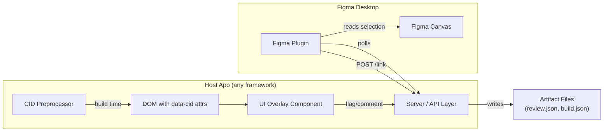
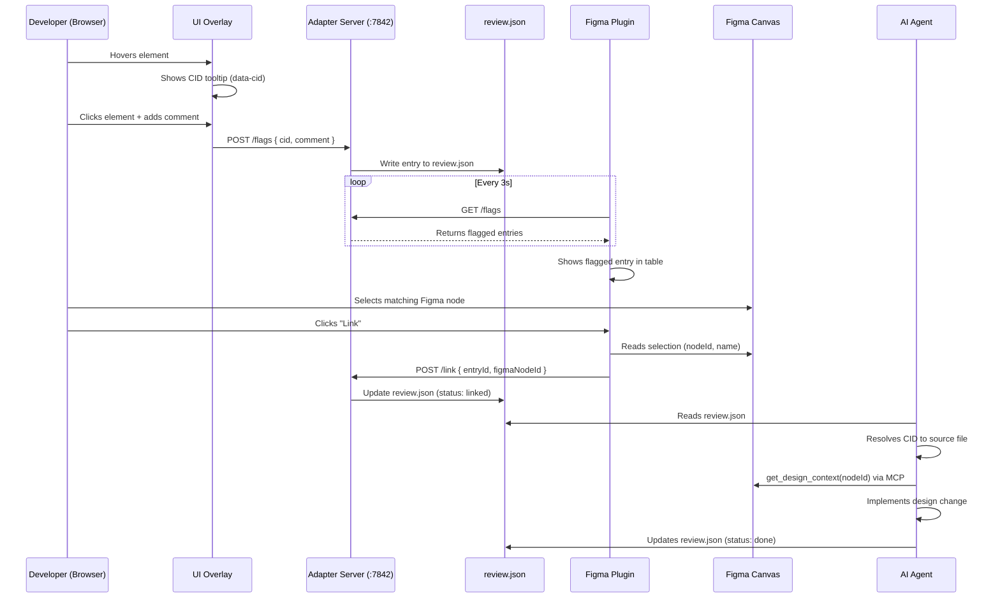

# Figma Code Link — Technical Spec

> Internal reference for LLMs and contributors. Describes the system architecture, current implementation state, and planned features.

---

## 1. Overview & Purpose

Figma Code Link is a **bidirectional bridge between design and code**. It lets a developer:

1. **Hover** a running UI element in the browser and see its source-file identity (`data-cid`)
2. **Flag** that element with a design comment
3. **Link** it to its Figma design node inside a Figma plugin
4. **Export** the mapping as structured data (CID ↔ Figma Node ↔ Comment)

The system is designed for use by both humans and AI coding agents (Claude Code, Copilot). Mappings and comments become machine-readable context that agents use to locate the exact source file/line for a given design component and to fetch the Figma design via MCP.

---

## 2. Architecture — Two Halves



| Half | Lives in | Role |
|------|----------|------|
| **Adapter** (server-side + CID preprocessor + overlay) | Host app repo (installed as npm package) | Instruments the codebase, provides dev UI, exposes HTTP API |
| **Figma Plugin** | `figma-code-link` repo, `packages/figma-plugin/` | Consumes flagged entries, links to Figma nodes, manages export |

---

## 3. The Adapter — Generic Pattern

Each framework adapter is an npm package (`figma-code-link-svelte`, `figma-code-link-nextjs`, etc.) that provides three capabilities when installed in a host project:

### 3.1 CID Preprocessing

**What it does:** At build/dev time, injects `data-cid="Filename.ext:lineNumber"` onto every HTML/JSX element. This gives every DOM node a stable, source-traceable identity.

**Rules:**
- **Dev only** — gated by `NODE_ENV !== 'production'`
- **No manual maintenance** — CID values are derived from filename + line number
- **Manual override** — if `data-cid` is already present, the preprocessor skips it
- **Component tags skipped** — only native HTML elements get CIDs (not `<MyComponent>`)

**Output example:**
```html
<!-- Input (SomeComponent.svelte:14) -->
<div class="card">
  <button>Click me</button>
</div>

<!-- Output -->
<div class="card" data-cid="SomeComponent.svelte:14">
  <button data-cid="SomeComponent.svelte:15">Click me</button>
</div>
```

**Per-framework implementation differs:**

| Framework | Mechanism | Hook Point |
|-----------|-----------|------------|
| **Svelte** | Svelte preprocessor (`markup` hook) | Registered in `svelte.config.js` |
| **Next.js / React** | Babel or SWC plugin | Traverses JSX AST, injects `data-cid` as prop |

### 3.2 UI Overlay

A **dev-only** component injected into the app's root layout that provides an in-browser element inspector:

**Capabilities:**
- **Toggle FAB** (bottom-right) — enables/disables hover inspection mode
- **Hover mode** — mouseover any `[data-cid]` element shows dashed outline + CID label tooltip
- **Click to flag** — click an element to open a comment panel; on confirm, the entry is sent to the server
- **Visual indicators** — flagged elements get orange dashed outline; linked elements get green solid outline

**Integration point:**
- Svelte: `<FigmaLinkOverlay />` in `+layout.svelte`
- Next.js: `<FigmaCodeLinkOverlay />` in `layout.tsx`

### 3.3 Server / API Layer

Exposes an HTTP server on a fixed port (default `localhost:7842`) for the Figma plugin to communicate with. The server manages in-memory state of flagged/linked entries.

**Endpoints:**

| Method | Path | Purpose |
|--------|------|---------|
| `GET` | `/flags` | Returns current flagged entry (or array of entries) |
| `POST` | `/link` | Links the current entry to a Figma node (`{ figmaNodeId }`) |

**Per-framework implementation differs:**

| Framework | Server Implementation |
|-----------|-----------------------|
| **Svelte/Tauri** | Axum-based HTTP server on port 7842, runs in Tauri's async runtime |
| **Next.js** | API routes under `app/api/figma-link/` in the Next.js dev server |
| **Generic** | Could be a standalone Express/Fastify server spun up by the adapter |

---

## 4. The Figma Plugin

**Repo:** `figma-code-link/packages/figma-plugin/`

A local-only Figma plugin (not published to community) that bridges from the dev app's flagged entries to Figma's design nodes.

### 4.1 File Structure

```
packages/figma-plugin/
├── manifest.json        # Plugin metadata, network access config
├── code.ts / code.js    # Sandbox code (runs in Figma's JS runtime)
├── ui.html              # Plugin UI (rendered in plugin iframe)
└── README.md
```

### 4.2 Plugin Sandbox (`code.ts`)

Runs in Figma's restricted JavaScript environment. Responsibilities:
- **`LINK` message** → reads `figma.currentPage.selection[0]`, returns `{ nodeId, nodeName }` to UI
- **`NOTIFY` message** → shows Figma toast notification
- **`CLOSE` message** → closes plugin

### 4.3 Plugin UI (`ui.html`)

Self-contained HTML/CSS/JS application running in the plugin iframe. No build step.

**State machine:**
```
waiting → flagged → success → waiting
```

| State | What the user sees |
|-------|-------------------|
| `waiting` | Pulsing dot + "Waiting for a flagged element..." |
| `flagged` | Card showing CID + comment, "Link Selected Node" button |
| `success` | Linked output block with copy-to-clipboard |

**Polling:** Every 3 seconds, fetches `GET http://localhost:7842/flags`. When a flagged entry appears, transitions to `flagged` state.

**Linking flow:**
1. User selects a Figma node on canvas
2. Clicks "Link Selected Node" in plugin UI
3. UI sends `LINK` message to sandbox → sandbox reads selection → returns `NODE_ID` message
4. UI POSTs `{ figmaNodeId: "NodeName (nodeId)" }` to `localhost:7842/link`
5. Transitions to `success` state, shows copy-able output

**Network access:** `devAllowedDomains: ["http://localhost:7842"]` (production domains: `none`)

### 4.4 Output Format

```
CID: Button.svelte:42
Figma Node: ComponentName (node_id)
Comment: This button doesn't look right
```

---

## 5. Current Implementation State

### ✅ Implemented

| Component | Location | Status |
|-----------|----------|--------|
| **CID Preprocessor (Svelte)** | [cidPreprocessor.ts](file:///Users/evindrews/Documents/origami-app/src/lib/preprocessors/cidPreprocessor.ts) | Complete — regex-based parser, handles native tags, skips script/style, respects manual overrides |
| **UI Overlay (Svelte)** | [FigmaLinkOverlay.svelte](file:///Users/evindrews/Documents/origami-app/src/lib/components/FigmaLinkOverlay.svelte) | Complete — FAB toggle, hover inspector, click-to-flag panel, linked status banner |
| **Server (Tauri/Axum)** | [figma_link.rs](file:///Users/evindrews/Documents/origami-app/src-tauri/src/commands/figma_link.rs) | Complete — single-entry in-memory store, HTTP server on :7842, CORS-permissive |
| **Figma Plugin** | [figma-plugin/](file:///Users/evindrews/Documents/figma-code-link/packages/figma-plugin/) | Complete — single-entry wizard flow, polling, link, copy |
| **Frontend service/API** | [figmaLink.service.ts](file:///Users/evindrews/Documents/origami-app/src/lib/services/figmaLink.service.ts), [api.ts](file:///Users/evindrews/Documents/origami-app/src/lib/api.ts) | Complete — Tauri IPC bindings for flag/get/save/clear |
| **Global CSS indicators** | [app.css](file:///Users/evindrews/Documents/origami-app/src/app.css) | Complete — `.figma-cid-hover`, `.figma-cid-flagged`, `.figma-cid-linked` |
| **Layout integration** | [+layout.svelte](file:///Users/evindrews/Documents/origami-app/src/routes/+layout.svelte) | Complete — `<FigmaLinkOverlay />` mounted in root layout |
| **Stores** | [stores.ts](file:///Users/evindrews/Documents/origami-app/src/lib/stores.ts#L809-813) | Complete — `figmaLinkOverlayEnabled`, `currentFigmaEntry` |

### ⚠️ Current Limitations

- **Single-entry only** — backend stores `Option<FigmaLinkEntry>`, not a list. Only one element can be flagged at a time.
- **Svelte-specific** — preprocessor, overlay, and service are tightly coupled to the origami-app's Svelte/Tauri stack. Not yet packaged as a reusable `npm` module.
- **No file persistence** — entries live in-memory only; lost on app restart. No `figma-link.json`, `review.json`, or `build.json` written to disk.
- **No thumbnail support** — no screenshot capture of flagged elements.
- **No adapter-nextjs implementation** — `packages/adapter-nextjs/` exists as a scaffold with empty `src/index.ts`.

---

## 6. What Needs to Be Built

### 6.1 Adapter Extraction & Packaging

**Goal:** Extract the Svelte-specific implementation into a reusable `figma-code-link-svelte` npm package, then create `figma-code-link-nextjs`.

| Task | Description | Complexity |
|------|-------------|------------|
| **Extract `adapter-svelte`** | Move CID preprocessor, overlay component, and HTTP server into `packages/adapter-svelte/`. Package as npm module that exports: `cidPreprocessor()`, `<FigmaLinkOverlay />`, and `startServer()`. | Medium |
| **Build `adapter-nextjs`** | CID injection via Babel/SWC plugin for JSX. Overlay as React component in `layout.tsx`. Server as Next.js API routes (`app/api/figma-link/`). | Medium-High |
| **Generic server abstraction** | Shared HTTP contract that adapters implement. Should support both embedded (Tauri, Next.js API routes) and standalone (Express) modes. | Low |

### 6.2 Multi-Entry State

**Goal:** Replace `Option<FigmaLinkEntry>` with `Vec<FigmaLinkEntry>` so multiple elements can be flagged and linked in a single session.

- Backend: ordered list with stable `entry_id` per row
- HTTP API: `GET /flags` returns array; `POST /flags` creates row; `POST /link` accepts `entryId`; `DELETE /flags/:id` and `DELETE /flags`
- Plugin UI: 4-column table layout (`cid | link icon | node_id | comment`)
- Per-row copy + bulk copy-all / clear-all

### 6.3 File Artifacts (`review.json`, `build.json`)

**Goal:** Persist design review state to git-tracked files that AI agents can read.

| File | Purpose | Written by |
|------|---------|------------|
| `review.json` | Active design review entries (flagged/linked items, comments, status). Used by Claude Code / Copilot to understand "what needs to change". | Adapter server, on flag/link |
| `build.json` | Build-time CID map (component → file → line). Used by agents to resolve a CID to its source. | CID preprocessor, on build |

### USER COMMENT: `build.json`, or a CID map, is not necessary. Currently, all adapters should generate a the CID like: "Filename:LineNumber" e.g `data-cid="Button.svelte:42"`, so mapping is not necessary; the LLM just knows the filename and line. If we have a data-cid though inline already (e.g hand written) the preprocessor shouldn't overwrite it. 

**Schema (review.json):**
```json
{
  "version": 1,
  "entries": [
    {
      "entryId": "uuid",
      "cid": "Button.svelte:42",
      "file": "src/lib/components/Button.svelte",
      "line": 42,
      "comment": "This button doesn't look right",
      "figmaNodeId": "1234:5678",
      "figmaNodeName": "Button / Primary",
      "status": "linked",
      "flaggedAt": "2026-02-28T12:00:00Z",
      "linkedAt": "2026-02-28T12:05:00Z"
    }
  ]
}
```

This is the foundation for **bidirectional ticket management** — designers flag issues in the running app, agents pick up entries from `review.json` as work items, and mark them `done` when resolved.

### 6.4 Thumbnail / Screenshot Capture

**Goal:** When flagging an element, capture a PNG screenshot of its bounding box using `html2canvas` or native Canvas API. Display in the Figma plugin alongside the CID.

- Overlay captures screenshot on flag confirm
- Server stores PNG to `.figma-link/assets/<encoded-cid>.png`
- Plugin fetches and displays inline `` per row
- **Gated:** feature-flagged, non-blocking to core flow

### 6.5 Bidirectional Ticket Management

**Goal:** Design review entries in `review.json` serve as actionable tickets that flow in both directions:

```
Designer flags → review.json → Agent picks up → Agent resolves → marks done
Agent needs design → creates entry → Designer links Figma node → Agent fetches via MCP
```

| Direction | Flow |
|-----------|------|
| **Design → Code** | Designer flags element in overlay → entry appears in review.json → Copilot/Claude reads it as a task |
| **Code → Design** | Agent creates entry in review.json requesting design context → designer links Figma node → agent fetches design via `get_design_context` MCP call |

### 6.6 Plugin Upgrades

| Feature | Description |
|---------|-------------|
| **Multi-row table** | Replace single-entry wizard with 4-column table |
| **Row-targeted linking** | `LINK_FOR_ROW` message protocol with `entryId` |
| **Copy/export actions** | Per-row copy, copy-all, clear-all buttons |
| **Status lifecycle** | `flagged → linked → done` toggle per row |
| **Unlink / remove** | Clear Figma node binding or delete entry entirely |

---

## 7. Data Flow — End to End



---

## 8. Adapter Installation — Target DX

The adapter should be quick to install in any supported project. Target experience:

```bash
npm install --save-dev figma-code-link-svelte
# or
npm install --save-dev figma-code-link-nextjs
```

**Setup steps (Svelte example):**

1. **Register preprocessor** in `svelte.config.js`:
   ```js
   import { cidPreprocessor } from 'figma-code-link-svelte';
   export default {
     preprocess: [vitePreprocess(), cidPreprocessor()],
     // ...
   };
   ```

2. **Add overlay** in root `+layout.svelte`:
   ```svelte
   <script>
     import { FigmaLinkOverlay } from 'figma-code-link-svelte';
   </script>
   <FigmaLinkOverlay />
   <slot />
   ```

3. **Start server** (auto-starts in dev, or explicit):
   ```js
   // vite.config.ts plugin, or standalone
   import { startFigmaLinkServer } from 'figma-code-link-svelte/server';
   startFigmaLinkServer({ port: 7842 });
   ```

**Setup steps (Next.js example):**

1. **Configure Babel/SWC plugin** in `next.config.js`
2. **Add overlay** in `app/layout.tsx`
3. **Add API routes** at `app/api/figma-link/`

---

## 9. Key File References

### `figma-code-link` repo

| File | Purpose |
|------|---------|
| [packages/figma-plugin/manifest.json](file:///Users/evindrews/Documents/figma-code-link/packages/figma-plugin/manifest.json) | Plugin config, network access whitelist |
| [packages/figma-plugin/code.ts](file:///Users/evindrews/Documents/figma-code-link/packages/figma-plugin/code.ts) | Sandbox: selection reading, message bridge |
| [packages/figma-plugin/ui.html](file:///Users/evindrews/Documents/figma-code-link/packages/figma-plugin/ui.html) | Plugin UI: polling, state machine, linking flow |
| [packages/adapter-nextjs/](file:///Users/evindrews/Documents/figma-code-link/packages/adapter-nextjs/) | Scaffold only (empty `src/index.ts`) |

### `origami-app` repo (current Svelte adapter — to be extracted)

| File | Purpose |
|------|---------|
| [src/lib/preprocessors/cidPreprocessor.ts](file:///Users/evindrews/Documents/origami-app/src/lib/preprocessors/cidPreprocessor.ts) | CID injection preprocessor (312 lines) |
| [src/lib/components/FigmaLinkOverlay.svelte](file:///Users/evindrews/Documents/origami-app/src/lib/components/FigmaLinkOverlay.svelte) | Overlay component (377 lines) |
| [src-tauri/src/commands/figma_link.rs](file:///Users/evindrews/Documents/origami-app/src-tauri/src/commands/figma_link.rs) | Rust backend: store + HTTP server (151 lines) |
| [src/lib/services/figmaLink.service.ts](file:///Users/evindrews/Documents/origami-app/src/lib/services/figmaLink.service.ts) | Service layer: flag/save/clear orchestration |
| [src/lib/api.ts](file:///Users/evindrews/Documents/origami-app/src/lib/api.ts#L2234-2254) | Tauri IPC bindings for figma_link commands |
| [svelte.config.js](file:///Users/evindrews/Documents/origami-app/svelte.config.js) | Where `cidPreprocessor()` is registered |

---

## 10. Glossary

| Term | Definition |
|------|-----------|
| **CID** | Component ID — `data-cid` attribute injected onto DOM elements. Format: `Filename.ext:lineNumber` |
| **Flagged** | An element the user clicked in the overlay. Has a CID and optional comment. Awaiting Figma node link. |
| **Linked** | A flagged element that has been associated with a Figma node ID. |
| **Adapter** | Framework-specific npm package (e.g. `figma-code-link-svelte`) providing CID preprocessor, overlay, and server |
| **review.json** | Git-tracked file of design review entries. Serves as a ticket queue for AI agents. |
| **build.json** | Build-time CID → source file mapping. Generated by preprocessor. |
